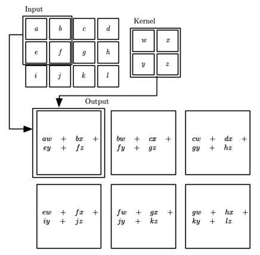

# Redes Neurais Convolucionais

Redes Neurais Convolucionais (CNNs) são um tipo de rede neural que são usadas para tratar dados em um formato de 'grid', como por exemplo, imagens.

Elas recebem esse nome pois em pelo menos uma de suas camadas, elas utilizam uma operação matemática chamada convolução.

## Convolução

Trata-se de uma operação matemática que consiste em multiplicar uma matriz de entrada por um kernel, que é uma matriz menor que a matriz de entrada. O kernel é deslizado sobre a matriz de entrada, multiplicando os elementos da matriz de entrada pelos elementos do kernel, e somando o resultado.

Espera-se obter uma matriz de saída menor que a matriz de entrada, que é chamada de `feature map`. Esse `feature map` é uma representação da matriz de entrada que destaca características específicas da matriz de entrada como bordas, texturas, etc.

Visualmente podemos entender a operação de convolução como uma janela que percorre a imagem, multiplicando os valores da janela pelos valores do kernel, e somando o resultado.

Em uma imagem podemos entender como:

## Pooling

Pooling é uma operação que reduz a dimensionalidade da matriz de entrada, mantendo as características mais importantes.

Existem diferentes tipos de pooling
- Max pooling - mantém o maior valor da janela
- Average pooling - calcula a média dos valores da janela

## Arquitetura

Uma CNN é composta por camadas de convolução, camadas de pooling e camadas densas (fully connected).

(1) **Camadas de convolução** recebem uma imagem de entrada e aplica um conjunto de filtros para extrair características da imagem

A operação de convolução é feita em um kernel inicializado aleatoriamente, e o objetivo do treinamento é encontrar os valores do kernel que melhor extraem as características da imagem.

Após a convolução, para cada pixel da imagem resultante, é aplicada a função de ativação que tem como propósito adicionar não lineariade à rede.

(2) **Camadas de pooling** reduzem a dimensionalidade da imagem, mantendo as características mais importantes

(3) **Camadas densas** são redes neurais tradicionais que recebem as características extraídas pelas camadas de convolução e pooling, e classificam a imagem
